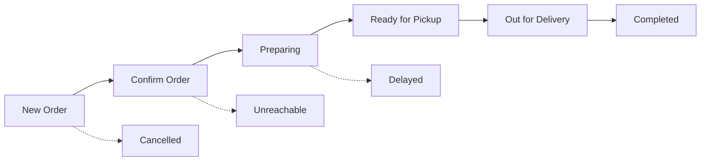

# Order Card UX Redesign Plan

## Executive Summary

This document outlines a comprehensive redesign of the Order Card experience for the Karebe delivery platform. The goal is to transform the current order management interface from a developer-focused technical implementation into a **professional, shop-owner-friendly dashboard** comparable to platforms like Shopify, Square, or food delivery merchant tools.

---

## Part 1: Current State Audit

### 1.1 Order ID System Analysis

**Current Implementation:**
- Orders use UUID format (e.g., `demo-001` or actual UUID like `550e8400-e29b-41d4-a716-446655440000`)
- Frontend displays only last 6 characters: `#order.id.slice(-6)`
- No human-friendly reference system exists

**Problems Identified:**
- UUIDs are impossible to say aloud or remember
- Last 6 characters provide no contextual meaning
- Shop owners cannot reference orders verbally (phone calls, WhatsApp, shouting across store)
- No branch identifier included
- No day/time context

**Files Affected:**
- `karebe-react/src/features/orders/api/admin-orders.ts` (line 235: `#{order.id.slice(-6)}`)
- `karebe-react/src/features/orders/components/order-card.tsx` (line 235)

### 1.2 Order Status System Analysis

**Current Statuses (9 total):**
| Status | Label | Color | Priority |
|--------|-------|-------|----------|
| CART_DRAFT | Draft | Gray | 6 |
| ORDER_SUBMITTED | New Order | Blue | 1 |
| CONFIRMED_BY_MANAGER | Confirmed | Green | 2 |
| DELIVERY_REQUEST_STARTED | Pending Call | Orange | 3 |
| RIDER_CONFIRMED_DIGITAL | Rider Assigned | Purple | 4 |
| RIDER_CONFIRMED_MANUAL | Rider Assigned | Purple | 4 |
| OUT_FOR_DELIVERY | Out for Delivery | Orange | 5 |
| DELIVERED | Delivered | Emerald | 7 |
| CANCELLED | Cancelled | Red | 8 |

**Problems Identified:**
- `DELIVERY_REQUEST_STARTED` status is confusing (shows "Pending Call" but doesn't explain what to call)
- Confusing distinction between `RIDER_CONFIRMED_DIGITAL` and `RIDER_CONFIRMED_MANUAL` for shop owners
- Status names are technical/internal, not customer-facing
- No clear workflow progression visible to operators

**Files Affected:**
- `karebe-orchestration/orchestration-service/src/types/order.ts` (lines 5-17)
- `karebe-orchestration/orchestration-service/src/services/stateMachine.ts` (lines 18-45)
- `karebe-react/src/features/orders/components/order-card.tsx` (lines 58-77)

### 1.3 Current OrderCard UI Analysis

**What's Currently Shown:**
- Order ID (last 6 chars of UUID)
- Status badge with color
- Customer name
- Phone number (tap-to-call enabled)
- Delivery address
- Order time (relative)
- Items count and total price
- Rider info (when assigned)
- Action buttons based on status

**Current Action Buttons:**
- `ORDER_SUBMITTED` → "Confirm Order"
- `CONFIRMED_BY_MANAGER` → "Assign Rider"
- `DELIVERY_REQUEST_STARTED` → "Start Delivery"
- Has edit functionality for order details

**Problems Identified:**
- No explicit "Call Customer" button (relies on tap-to-call on phone number)
- "Pending Call" status doesn't explain what action is needed
- No order age indicator beyond relative time
- No visual urgency for old orders
- Card layout is information-dense but not scannable
- No delivery/pickup indicator visible
- No payment method indicator

**Files Affected:**
- `karebe-react/src/features/orders/components/order-card.tsx` (entire component)
- `karebe-react/src/pages/admin/orders.tsx` (lines 109-137)

### 1.4 Real-time Update System

**Current Implementation:**
- Polls every 30 seconds: `setInterval(fetchOrders, 30000)` in `orders.tsx`
- No optimistic UI updates
- No visual indicator of new orders arriving

**Problems Identified:**
- 30-second polling is too slow for busy periods
- No notification when new orders arrive
- No visual indicator of connection status

---

## Part 2: Human-Friendly Operational Order IDs

### 2.1 Design Goals

The order ID system must be:
- **Short**: Maximum 8 characters for easy reference
- **Speakable**: Can be pronounced clearly over phone/WhatsApp
- **Memorable**: Contains meaningful context
- **Typeable**: Easy to type on mobile keyboard
- **Unique per day**: Avoids confusion between days
- **Branch-aware**: Supports multiple locations

### 2.2 Recommended Format

**Primary Format: `#KRB-XXX`**
```
KRB = Karebe prefix (3 chars)
- = separator
XXX = Daily sequence number (3 digits, 001-999)
```

**Alternative Formats:**

1. **With Day Indicator**: `#KRB-WED-042` (for verbal use)
   - Good for multi-branch: `#KRB-WED-042-M` (M = Main branch)

2. **Numeric Short**: `#1042` (4 digits, branch + day sequence)
   - First digit: Branch code (1=Main, 2=Branch B, etc.)
   - Last 3: Daily sequence

3. **Alphanumeric**: `#A317` (letter + 3 digits)
   - Letter: Day of week (A=Sunday, B=Monday, etc.) or branch code
   - 3 digits: Daily sequence

### 2.3 Implementation Approach

**Database Changes:**
```sql
-- Add human-friendly order reference
ALTER TABLE orders ADD COLUMN IF NOT EXISTS order_reference VARCHAR(20) UNIQUE;

-- Add fields for generating references
ALTER TABLE orders ADD COLUMN IF NOT EXISTS branch_code VARCHAR(5);
ALTER TABLE orders ADD COLUMN IF NOT EXISTS daily_sequence INTEGER;
```

**Generation Algorithm:**
```typescript
function generateOrderReference(branchCode: string, dailySequence: number): string {
  const prefix = 'KRB';
  const sequence = String(dailySequence).padStart(3, '0');
  return `${prefix}-${sequence}`;
}

// Alternative with day: KRB-WED-042
function generateDayReference(branchCode: string, dayOfWeek: string, sequence: number): string {
  const days = ['SUN', 'MON', 'TUE', 'WED', 'THU', 'FRI', 'SAT'];
  const day = days[dayOfWeek];
  const seq = String(sequence).padStart(3, '0');
  return `${branchCode}-${day}-${seq}`;
}
```

**API Changes:**
- Add `order_reference` to all order API responses
- Support lookup by both UUID and order_reference
- Add endpoint: `GET /api/orders/by-reference/:reference`

**UI Changes:**
- Replace `#{order.id.slice(-6)}` with `#{order.order_reference}`
- Add "Quick Search by Order #" input field
- Display order reference prominently on all order-related communications

### 2.4 Migration Strategy

1. Generate unique `order_reference` for all existing orders on first migration
2. Use format: `KRB-{last6OfUUID}` for existing orders
3. New orders get sequential references
4. Maintain backward compatibility with UUID lookups

---

## Part 3: Workflow-Based Order States

### 3.1 Proposed State Machine

**New Simplified Workflow:**



**Proposed Status Mapping:**

| Current Status | New Status | UI Label | Description |
|---------------|------------|----------|-------------|
| ORDER_SUBMITTED | NEW | 🔵 New Order | Just received, needs review |
| (new) | CONFIRMING | 🟠 Confirming | Calling customer to confirm |
| CONFIRMED_BY_MANAGER | PREPARING | 🟣 Preparing | Order being prepared |
| DELIVERY_REQUEST_STARTED | READY | 🟢 Ready | Ready for pickup/delivery |
| RIDER_CONFIRMED_DIGITAL/ MANUAL | OUT_FOR_DELIVERY | 🚴 Out for Delivery | With rider |
| OUT_FOR_DELIVERY | COMPLETED | ✅ Completed | Delivered |
| CANCELLED | CANCELLED | ❌ Cancelled | Cancelled |

**Additional Statuses:**

| Status | Label | Description |
|--------|-------|-------------|
| UNREACHABLE | Unreachable | Customer not answering |
| DELAYED | Delayed | Order delayed, inform customer |

### 3.2 Action Button Design

**Workflow Actions (replacing enum editing):**

| Current State | Available Actions |
|--------------|-------------------|
| NEW | ✓ Confirm Order, ✗ Cancel, 📞 Call Customer |
| CONFIRMING | ✓ Start Preparing, ✓ Unreachable, ✗ Cancel |
| PREPARING | ✓ Mark Ready, ⏰ Delay |
| READY | ✓ Send Out (Delivery), ✓ Mark Picked Up (Pickup), ✗ Cancel |
| OUT_FOR_DELIVERY | ✓ Confirm Delivery |
| COMPLETED | (No actions - terminal) |
| CANCELLED | (No actions - terminal) |

**Button Labels (Shop Owner Language):**

```typescript
const actionLabels = {
  NEW: {
    primary: 'Confirm Order',
    secondary: 'Call Customer',
    danger: 'Cancel'
  },
  CONFIRMING: {
    primary: 'Start Preparing',
    secondary: 'Mark Unreachable',
    danger: 'Cancel'
  },
  PREPARING: {
    primary: 'Mark Ready',
    secondary: 'Report Delay'
  },
  READY: {
    primary: 'Send Out for Delivery',
    secondary: 'Customer Picking Up'
  },
  OUT_FOR_DELIVERY: {
    primary: 'Confirm Delivered'
  }
};
```

### 3.3 Implementation Requirements

**Backend Changes:**

1. Add new status enum values to `OrderStatus` type
2. Update `stateMachine.ts` with new transitions
3. Add transition validation for new states

**Frontend Changes:**

1. Update `statusConfig` mapping
2. Replace status dropdown with action buttons
3. Add visual feedback for action in progress

---

## Part 4: Order Card Information Architecture

### 4.1 Information Priority

**Must Show (Primary Scan Area):**
1. **Order Reference** - Large, bold, top-left (#KRB-042)
2. **Status Badge** - Clear visual with action required
3. **Customer Name** - Who is this order for?
4. **Total Price** - How much?
5. **Next Action** - What should I do now?

**Should Show (Quick Context):**
6. Items count - "3 items"
7. Order age - "12 min ago" with urgency indicator
8. Delivery/Pickup indicator - 🚗 Delivery or 🏪 Pickup
9. Phone - tap-to-call

**Nice to Show (Expanded):**
10. Address summary
11. Payment method
12. Rider info (when assigned)
13. Delivery notes

### 4.2 Card Layout Wireframe

```
┌─────────────────────────────────────────────────────────────┐
│ #KRB-042     [🟢 READY]              12 min ago    [⋮]     │
│ ─────────────────────────────────────────────────────────── │
│ 🏪 Pickup    │ John D.                      KES 7,000      │
│              │ 📞 +254 712 345 678          3 items        │
│              │ 📍 Westlands, Nairobi                        │
├─────────────────────────────────────────────────────────────┤
│ [  Send Out for Delivery  ]  [  Customer Picking Up  ]    │
└─────────────────────────────────────────────────────────────┘
```

### 4.3 Mobile Optimization

**Requirements:**
- Minimum touch target: 44x44px
- Primary action button: Full width, prominent
- Collapsible details section
- Swipe gestures for quick actions (optional)
- Large status badges for visibility
- Avoid dropdown menus - use buttons instead

---

## Part 5: Visual Priority and Urgency

### 5.1 Status Color System

| Status | Badge Color | Background | Border | Icon |
|--------|-------------|------------|--------|------|
| NEW | Blue bg | Blue-50 | Blue-200 | 📥 |
| CONFIRMING | Orange bg | Orange-50 | Orange-200 | 📞 |
| PREPARING | Purple bg | Purple-50 | Purple-200 | 📦 |
| READY | Green bg | Green-50 | Green-200 | ✓ |
| OUT_FOR_DELIVERY | Cyan bg | Cyan-50 | Cyan-200 | 🚴 |
| COMPLETED | Emerald bg | Emerald-50 | Emerald-200 | ✅ |
| DELAYED | Red bg | Red-50 | Red-200 | ⏰ |
| UNREACHABLE | Gray bg | Gray-50 | Gray-200 | 📵 |
| CANCELLED | Red outline | Red-50 | Red-200 | ✗ |

### 5.2 Time-Based Alerts

**Alert Thresholds:**

| Status | Normal | Warning | Urgent |
|--------|--------|---------|--------|
| NEW | < 5 min | 5-15 min | > 15 min |
| CONFIRMING | < 5 min | 5-10 min | > 10 min |
| PREPARING | < 15 min | 15-30 min | > 30 min |
| READY | < 30 min | 30-60 min | > 60 min |

**Visual Indicators:**

- **Normal**: Default colors
- **Warning**: Pulsing subtle glow, yellow indicator dot
- **Urgent**: Red pulsing border, prominent alert icon, shake animation on card

### 5.3 Accessibility Considerations

- Never rely on color alone - include icons and text labels
- High contrast ratios for all text
- Status changes announced to screen readers
- Focus indicators for keyboard navigation

---

## Part 6: Real-time Updates

### 6.1 Polling Enhancement

**Current:** 30-second interval
**Proposed:** 
- 10-second interval for active orders
- 30-second interval for completed orders
- Immediate refresh on window focus

### 6.2 WebSocket Implementation (Future)

```typescript
// Real-time subscription
supabase
  .channel('orders')
  .on('postgres_changes', {
    event: 'INSERT',
    schema: 'public',
    table: 'orders'
  }, (payload) => {
    // Show notification
    showNewOrderNotification(payload.new);
  })
  .on('postgres_changes', {
    event: 'UPDATE',
    schema: 'public',
    table: 'orders'
  }, (payload) => {
    // Update order in place
    updateOrderCard(payload.new.id, payload.new);
  })
  .subscribe();
```

### 6.3 New Order Notification

- Play notification sound (optional, respects user preference)
- Show browser notification if tab not focused
- Badge update on orders tab
- Toast notification with order summary

---

## Part 7: Concurrency and Safety

### 7.1 Optimistic UI Updates

**Current:** No optimistic updates - waits for server response
**Proposed:**
1. Immediately update UI on action click
2. Show loading state on specific button only
3. Revert on server error with error toast
4. Auto-refresh after 2 seconds

### 7.2 Double-Click Prevention

```typescript
const processingOrders = new Set<string>();

async function handleAction(orderId: string, action: Action) {
  if (processingOrders.has(orderId)) return;
  
  processingOrders.add(orderId);
  try {
    await executeAction(orderId, action);
  } catch (error) {
    showError(error);
  } finally {
    processingOrders.delete(orderId);
  }
}
```

### 7.3 Lock Integration

- Use existing `order_locks` table for critical transitions
- Show "Someone else is editing" message if locked
- Auto-release locks after 5 minutes

---

## Part 8: Branch and Future Scaling

### 8.1 Branch Code Integration

```typescript
interface Branch {
  id: string;
  code: string; // e.g., 'M' for Main, 'W' for Westlands
  name: string;
  shortName: string;
}
```

**Order Reference with Branch:**
```
#KRB-M-042  (Main branch)
#KRB-W-017  (Westlands)
#KRB-K-103  (Kilimani)
```

### 8.2 Multi-Branch Views

- Filter orders by branch
- Global view with branch column
- Branch-specific dashboards
- Cross-branch order assignment

### 8.3 Future Rider Integration

- Add "Assign to Rider" action button
- Show rider on card when assigned
- Rider app integration
- Real-time location tracking (future)

---

## Part 9: Implementation Roadmap

### Phase 1: Foundation (Week 1-2)

- [ ] Add `order_reference` column to database
- [ ] Implement order reference generation logic
- [ ] Update API responses to include order_reference
- [ ] Add order_reference to frontend types

### Phase 2: Status Workflow (Week 2-3)

- [ ] Update status enum with new values
- [ ] Update state machine transitions
- [ ] Update status mapping in frontend
- [ ] Implement action button system

### Phase 3: Card Redesign (Week 3-4)

- [ ] Redesign OrderCard layout
- [ ] Implement priority indicators
- [ ] Add time-based alerts
- [ ] Improve mobile responsiveness

### Phase 4: Real-time & Polish (Week 4-5)

- [ ] Improve polling intervals
- [ ] Add new order notifications
- [ ] Implement optimistic UI updates
- [ ] Add branch filtering

### Phase 5: Testing (Week 5-6)

- [ ] Unit tests for order reference generation
- [ ] Integration tests for state transitions
- [ ] E2E tests for order workflow
- [ ] User acceptance testing

---

## Part 10: Backward Compatibility

### 10.1 Migration Strategy

1. **Database:**
   - Add new columns as nullable
   - Backfill existing orders with generated references
   - Add unique constraint after validation

2. **API:**
   - Keep existing UUID-based endpoints working
   - Add new order_reference to responses
   - Support both UUID and reference in lookups

3. **Frontend:**
   - Gracefully handle missing order_reference
   - Fall back to UUID slice if needed

### 10.2 Breaking Changes Mitigation

- New status values are additive (no removal)
- Action buttons handle both old and new statuses
- Default to most intuitive behavior for existing orders

---

## Part 11: Testing Strategy

### 11.1 Unit Tests

```typescript
describe('Order Reference Generation', () => {
  it('generates unique daily references', () => {});
  it('handles branch codes correctly', () => {});
  it('resets sequence daily', () => {});
  it('throws on duplicate reference attempt', () => {});
});

describe('State Machine', () => {
  it('allows valid transitions', () => {});
  it('blocks invalid transitions', () => {});
  it('handles all actor types correctly', () => {});
});
```

### 11.2 Integration Tests

```typescript
describe('Order Workflow', () => {
  it('complete order lifecycle: new → completed', () => {});
  it('handles cancellation at any stage', () => {});
  it('maintains audit trail for all transitions', () => {});
  it('handles concurrent updates safely', () => {});
});
```

### 11.3 E2E Tests

```typescript
describe('Order Card UI', () => {
  it('displays human-friendly order reference', () => {});
  it('shows correct action buttons for status', () => {});
  it('updates in real-time when status changes', () => {});
  it('prioritizes urgent orders visually', () => {});
  it('works on mobile viewport', () => {});
});
```

---

## Summary

This plan transforms the Order Card from a technical data display into a **professional operational tool** that:

1. **Human-Friendly IDs**: Shop owners can say "Order KRB-042" over the phone
2. **Clear Workflow**: Actions instead of status editing - "Confirm Order" not "Set CONFIRMED_BY_MANAGER"
3. **Visual Priority**: Instantly see which orders need attention
4. **Mobile-First**: Works great on phone/tablet behind the counter
5. **Safe**: Prevents mistakes with optimistic updates and double-click protection
6. **Scalable**: Ready for multiple branches and rider integration

The result will feel like a modern delivery platform dashboard - professional, fast, and designed for the realities of running a busy shop.