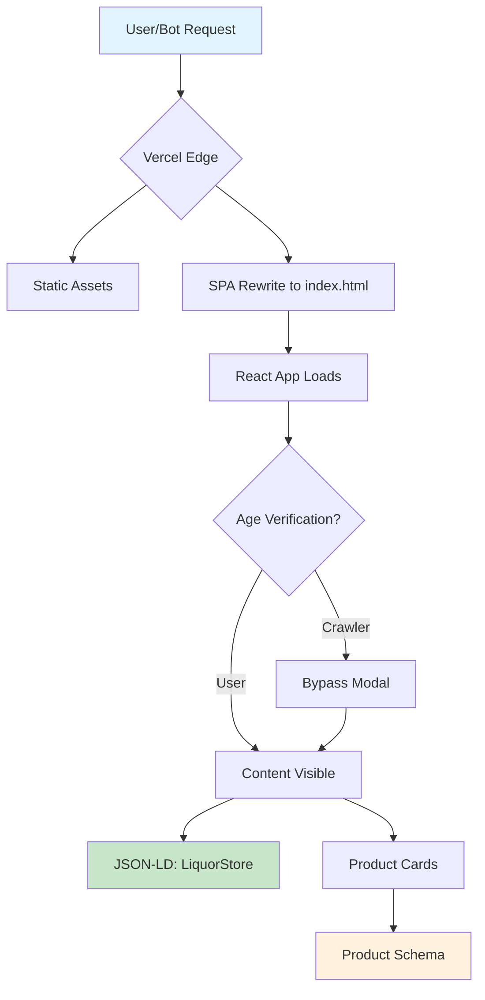

# KAREBE Wines & Spirits - SEO & Discoverability Audit Report

**Application URL:** karebe-lemon.vercel.app  
**Audit Date:** 2026-03-11  
**Framework:** Vite + React SPA (Client-Side Rendered)

---

## 1. Current SEO Readiness Score

### **Score: 72/100 (Good - With Critical Issues)**

| Category | Score | Status |
|----------|-------|--------|
| Metadata & Tags | 18/20 | ✅ Excellent |
| Local Business SEO | 18/20 | ✅ Excellent |
| Technical SEO | 12/20 | ⚠️ Moderate |
| Page Content SEO | 10/15 | ✅ Good |
| Performance | 8/10 | ✅ Good |
| Social Sharing | 4/10 | ❌ Broken |
| Product Schema | 2/5 | ❌ Missing |

---

## 2. What Already Works

### ✅ Framework & Infrastructure
- **Vite + React SPA** with code splitting via lazy loading
- **vercel.json** properly configured with SPA routing rewrites
- **Cache headers** configured for static assets (1 year immutable)
- **Clean URLs** enabled (`cleanUrls: true`)

### ✅ Metadata (Excellent)
The [`karebe-react/index.html`](karebe-react/index.html:1) contains comprehensive meta tags:

```html
<!-- Primary Meta Tags -->
<title>Karebe Wines & Spirits | Premium Alcohol Delivery in Kenya</title>
<meta name="title" content="Karebe Wines & Spirits | Premium Alcohol Delivery in Kenya" />
<meta name="description" content="Karebe Wines & Spirits - Your trusted source for premium wines, spirits, and beers in Kenya. Fast delivery to Nairobi and Kiambu counties..." />
<meta name="keywords" content="alcohol delivery Kenya, wine Nairobi, spirits Kenya..." />
<meta name="robots" content="index, follow" />
```

### ✅ OpenGraph / Social Metadata
- `og:type`, `og:url`, `og:title`, `og:description`, `og:image`, `og:site_name`, `og:locale`
- Twitter cards configured (`twitter:card`, `twitter:url`, `twitter:title`, `twitter:description`, `twitter:image`)
- **Geo tags** for local SEO (`geo.region`, `geo.placename`, `geo.position`)

### ✅ Search Engine Discoverability
- **[`robots.txt`](karebe-react/public/robots.txt:1)** exists and allows crawling
- **[`sitemap.xml`](karebe-react/public/sitemap.xml:1)** exists with 4 pages indexed

### ✅ Local Business SEO (JSON-LD)
The [`index.html`](karebe-react/index.html:55) includes comprehensive structured data:

```json
{
  "@context": "https://schema.org",
  "@type": "LiquorStore",
  "name": "Karebe Wines & Spirits",
  "telephone": "+254720123456",
  "address": {
    "streetAddress": "Wangige Town Centre, Off Waiyaki Way",
    "addressLocality": "Wangige",
    "addressRegion": "Kiambu County",
    "addressCountry": "KE"
  },
  "geo": { "latitude": "-1.2195", "longitude": "36.7088" },
  "openingHoursSpecification": [...],
  "areaServed": [{ "@type": "State", "name": "Nairobi County" }, { "@type": "State", "name": "Kiambu County" }]
}
```

### ✅ Page Content SEO
- **H1 tags** present in catalog page ([`catalog.tsx`](karebe-react/src/pages/customer/catalog.tsx:84))
- **Image alt text** present in ProductCard ([`product-card.tsx`](karebe-react/src/features/products/components/product-card.tsx:160))
- **Lazy loading** enabled on images (`loading="lazy"`)

### ✅ Local Search Presence
- Phone number visible in header (`+254 724 721627`)
- WhatsApp integration via [`whatsapp-fab.tsx`](karebe-react/src/components/contact/whatsapp-fab.tsx:1)
- Google Maps embed component available ([`google-maps-embed.tsx`](karebe-react/src/components/contact/google-maps-embed.tsx:1))

### ✅ Performance Optimizations
- Code splitting with manual chunks in [`vite.config.ts`](karebe-react/vite.config.ts:40)
- Lazy loading images
- Immutable cache headers for assets

---

## 3. What Is Missing

### ❌ Critical: Missing OG Image
- **og:image** points to `https://karebe.com/og-image.jpg` but **this file does NOT exist**
- Social sharing previews will be broken on WhatsApp, Facebook, Twitter, LinkedIn
- **Impact:** No rich previews when links are shared

### ❌ Product Structured Data
- No `schema.org/Product` markup for individual products
- Products lack: brand, aggregateRating, priceValidUntil
- **Impact:** No rich snippets in search results for products

### ❌ React SPA Indexing Limitation
- Client-side rendering only (no SSR)
- Age verification modal may interfere with crawler content access
- No `react-helmet` or similar for dynamic meta tags per page
- **Impact:** Google can index but requires JavaScript execution

### ❌ Dynamic Page Metadata
- All meta tags are static in index.html only
- Cart, checkout, and admin pages share home page metadata
- No canonical URLs for individual product pages

### ❌ Sitemap Limitations
- Sitemap only lists 4 pages (home, cart, checkout, admin)
- Missing: individual product pages, category pages
- No image sitemap

---

## 4. What Is Blocking Indexing

### ⚠️ Age Verification Modal
The [`AgeVerificationProvider`](karebe-react/src/components/seo/age-verification-modal.tsx:25) shows a modal dialog that:
- Appears after 500ms delay
- Blocks content until user action
- May confuse crawlers attempting to index page content
- Uses localStorage to track verification state

**Recommendation:** Modify to allow crawler bypass or server-side rendering consideration.

### ⚠️ Client-Side Rendering Only
- No SSR means crawlers must execute JavaScript
- Googlebot can handle this, but it's suboptimal
- Older crawlers may not see content properly

---

## 5. Quick Wins (High Impact, Low Effort)

### 🚀 Priority 1: Add OG Image (5 minutes)
Create an og-image.jpg (1200x630px) and place in public folder:

```html
<!-- Update index.html line 22 -->
<meta property="og:image" content="https://karebe.com/og-image.jpg" />
<meta property="twitter:image" content="https://karebe.com/og-image.jpg" />
```

**File needed:** `karebe-react/public/og-image.jpg` (1200x630px, < 500KB)

### 🚀 Priority 2: Fix Sitemap (10 minutes)
Add product pages to [`sitemap.xml`](karebe-react/public/sitemap.xml:1):

```xml
<url>
  <loc>https://karebe.com/products</loc>
  <lastmod>2026-03-11</lastmod>
  <changefreq>weekly</changefreq>
  <priority>0.9</priority>
</url>
```

### 🚀 Priority 3: Add Product Schema (30 minutes)
Add JSON-LD for products in ProductCard component:

```tsx
// In product-card.tsx, add structured data
useEffect(() => {
  const productSchema = {
    "@context": "https://schema.org",
    "@type": "Product",
    "name": product.name,
    "image": product.images[0],
    "description": product.description,
    "offers": {
      "@type": "Offer",
      "price": displayPrice,
      "priceCurrency": "KES",
      "availability": isOutOfStock 
        ? "https://schema.org/OutOfStock" 
        : "https://schema.org/InStock"
    }
  };
  
  const script = document.createElement('script');
  script.type = 'application/ld+json';
  script.textContent = JSON.stringify(productSchema);
  document.head.appendChild(script);
  
  return () => document.head.removeChild(script);
}, [product, displayPrice, isOutOfStock]);
```

### 🚀 Priority 4: Add Canonical URLs (5 minutes)
Update index.html to use dynamic canonical:

```html
<link rel="canonical" href="https://karebe.com" />
<!-- For SPA, consider using window.location.href in App.tsx -->
```

---

## 6. Advanced Improvements

### 🔧 Server-Side Rendering (Higher Effort)
Consider migrating to Next.js for:
- Full SSR for optimal SEO
- Dynamic meta tags per page
- Automatic sitemap generation
- Image optimization

### 🔧 Dynamic Metadata (Medium Effort)
Add react-helmet-async for per-page meta tags:

```bash
npm install react-helmet-async
```

```tsx
// In each page component
import { Helmet } from 'react-helmet-async';

function CatalogPage() {
  return (
    <>
      <Helmet>
        <title>Shop Wines & Spirits | Karebe Kenya</title>
        <meta name="description" content="Browse our selection..." />
      </Helmet>
      {/* page content */}
    </>
  );
}
```

### 🔧 Age Verification SEO Fix (Medium Effort)
Modify AgeVerificationProvider to allow crawlers:

```tsx
// Check for crawler user agents
const isCrawler = () => {
  const ua = navigator.userAgent;
  return /bot|crawler|spider|googlebot|bingbot/i.test(ua);
};

useEffect(() => {
  if (isCrawler()) {
    setIsVerified(true);
    return;
  }
  // ... existing logic
}, []);
```

### 🔧 Image SEO Enhancements (Medium Effort)
- Add `srcset` and `sizes` attributes to product images
- Add `width` and `height` attributes to prevent layout shift
- Consider WebP format conversion
- Add image sitemap

### 🔧 Local Business Enhancements (Low Effort)
Add more schema types:
- `hasMap` for Google Maps URL
- `priceRange` already present
- Add `review` aggregate ratings schema

---

## 7. Specific Code Changes Required

### File: karebe-react/public/og-image.jpg
**Action:** Create this file (1200x630px, recommended)

### File: karebe-react/public/sitemap.xml
**Action:** Expand to include more pages:

```xml
<?xml version="1.0" encoding="UTF-8"?>
<urlset xmlns="http://www.sitemaps.org/schemas/sitemap/0.9"
         xmlns:image="http://www.google.com/schemas/sitemap-image/1.1">
  <url>
    <loc>https://karebe.com/</loc>
    <lastmod>2026-03-11</lastmod>
    <changefreq>daily</changefreq>
    <priority>1.0</priority>
  </url>
  <url>
    <loc>https://karebe.com/cart</loc>
    <lastmod>2026-03-11</lastmod>
    <changefreq>weekly</changefreq>
    <priority>0.8</priority>
  </url>
  <url>
    <loc>https://karebe.com/checkout</loc>
    <lastmod>2026-03-11</lastmod>
    <changefreq>weekly</changefreq>
    <priority>0.6</priority>
  </url>
  <url>
    <loc>https://karebe.com/contact</loc>
    <lastmod>2026-03-11</lastmod>
    <changefreq>monthly</changefreq>
    <priority>0.5</priority>
  </url>
</urlset>
```

### File: karebe-react/src/features/products/components/product-card.tsx
**Action:** Add product schema (around line 99):

```tsx
useEffect(() => {
  if (!product) return;
  
  const schema = {
    "@context": "https://schema.org",
    "@type": "Product",
    "name": product.name,
    "description": product.description,
    "image": product.images[0] ? [product.images[0]] : [],
    "offers": {
      "@type": "Offer",
      "price": displayPrice,
      "priceCurrency": "KES",
      "availability": isOutOfStock 
        ? "https://schema.org/OutOfStock" 
        : "https://schema.org/InStock"
    },
    "brand": {
      "@type": "Brand",
      "name": "Karebe Wines & Spirits"
    }
  };
  
  const script = document.createElement('script');
  script.type = 'application/ld+json';
  script.text = JSON.stringify(schema);
  document.head.appendChild(script);
  
  return () => {
    if (document.head.contains(script)) {
      document.head.removeChild(script);
    }
  };
}, [product, displayPrice, isOutOfStock]);
```

### File: karebe-react/src/components/seo/age-verification-modal.tsx
**Action:** Add crawler bypass (around line 29):

```tsx
useEffect(() => {
  // Skip verification for search engine crawlers
  const userAgent = navigator.userAgent || '';
  const isCrawler = /bot|crawler|spider|googlebot|bingbot|duckduckbot/i.test(userAgent);
  
  if (isCrawler) {
    setIsVerified(true);
    return;
  }
  
  // Check if user has already verified their age
  const verified = localStorage.getItem(AGE_VERIFICATION_KEY);
  if (verified === 'true') {
    setIsVerified(true);
  } else {
    // Show modal after a short delay to let the page load
    const timer = setTimeout(() => {
      setIsOpen(true);
    }, 500);
    return () => clearTimeout(timer);
  }
}, []);
```

---

## 8. Summary & Action Items

| Priority | Action | Effort | Impact |
|----------|--------|--------|--------|
| 🔴 P1 | Add og-image.jpg | 5 min | High |
| 🔴 P2 | Add crawler bypass to age modal | 10 min | High |
| 🟡 P3 | Add product JSON-LD schema | 30 min | Medium |
| 🟡 P4 | Expand sitemap.xml | 10 min | Medium |
| 🟢 P5 | Add react-helmet for dynamic meta | 1 hr | Medium |
| 🟢 P6 | Consider Next.js migration | High | High |

---

## Mermaid: SEO Architecture Overview



---

*Report generated for KAREBE Wines & Spirits React Application*