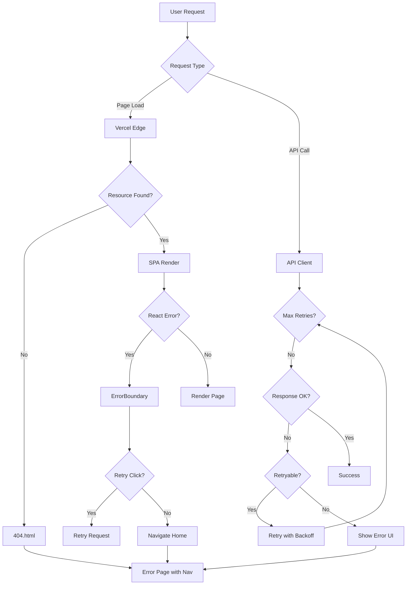

# Vercel Error Handling Configuration Plan

## Overview

This document outlines the strategy for configuring Vercel deployment to handle errors gracefully with custom error pages and recovery options.

## Current State Analysis

### Existing Error Handling
1. **ErrorBoundary Component** ([`karebe-react/src/components/seo/error-boundary.tsx`](karebe-react/src/components/seo/error-boundary.tsx:1))
   - Catches React component errors
   - Shows error message with retry and home navigation options
   - Displays development-only stack traces

2. **Vercel Configuration** ([`karebe-react/vercel.json`](karebe-react/vercel.json:1))
   - Uses rewrites to redirect all routes to index.html (SPA mode)
   - No custom error page configuration

3. **React Query** ([`karebe-react/src/main.tsx`](karebe-react/src/main.tsx:27))
   - Has retry: 2 configured
   - But no global error handling

---

## Implementation Plan

### Phase 1: Vercel Edge Error Pages

#### 1.1 Custom 404 Page
```json
// vercel.json - Add error handling
{
  "version": 2,
  "rewrites": [...],
  "errorPages": {
    "/404": "/404.html",
    "/500": "/500.html"
  }
}
```

Create static error pages in `public/`:
- `public/404.html` - Custom 404 with navigation
- `public/500.html` - Server error recovery

#### 1.2 Vercel ISR for Error Pages
Use Next.js-style error boundaries with Vite via `@vercel/analytics`

---

### Phase 2: Client-Side Error Handling

#### 2.1 Global Error Handler
Create [`karebe-react/src/lib/error-handler.ts`](karebe-react/src/lib/error-handler.ts):

```typescript
interface ErrorConfig {
  retryable: boolean;
  retryCount?: number;
  fallback?: string;
  userMessage: string;
}

class ErrorHandler {
  private errors: Map<string, ErrorConfig> = new Map();
  
  registerError config: ErrorConfig(code: string,) {
    this.errors.set(code, config);
  }
  
  handleError(error: Error, context?: string): ErrorDisplay {
    const config = this.errors.get(error.code);
    // Return appropriate UI state
  }
}
```

#### 2.2 Enhanced Error Boundary
Upgrade existing ErrorBoundary in [`karebe-react/src/components/seo/error-boundary.tsx`](karebe-react/src/components/seo/error-boundary.tsx:1):

- Add error categorization (network, auth, server, client)
- Implement exponential backoff retry
- Add error reporting (optional Sentry integration)

#### 2.3 API Error Interceptor
Create fetch wrapper with error handling:

```typescript
// src/lib/api-client.ts
async function apiRequest<T>(
  url: string, 
  options: RequestInit,
  retryConfig?: RetryConfig
): Promise<T> {
  try {
    const response = await fetch(url, options);
    
    if (!response.ok) {
      throw new ApiError(response.status, await response.json());
    }
    
    return response.json();
  } catch (error) {
    if (isRetryable(error) && retryConfig) {
      return retryWithBackoff(url, options, retryConfig);
    }
    throw error;
  }
}
```

---

### Phase 3: Route-Level Error Handling

#### 3.1 Not Found (404) Handler
Current: SPA fallback handles unknown routes

Enhanced approach:
- Add route validation in App.tsx
- Show meaningful 404 within app context

#### 3.2 API Error Pages
For `/api/*` routes, create error responses:

```typescript
// Edge function example
export default function handler(req: Request) {
  try {
    // API logic
  } catch (error) {
    return new Response(JSON.stringify({
      success: false,
      error: {
        code: 'INTERNAL_ERROR',
        message: 'Service temporarily unavailable',
        retryAfter: 30
      }
    }), {
      status: 500,
      headers: { 'Retry-After': '30' }
    });
  }
}
```

---

### Phase 4: Recovery Mechanisms

#### 4.1 Automatic Retry
- Network errors: 3 retries with exponential backoff
- 5xx errors: Retry once after 5 seconds
- 429 (rate limit): Respect Retry-After header

#### 4.2 User-Initiated Recovery
- "Try Again" button (with loading state)
- "Go Back" navigation
- "Contact Support" link for persistent errors

#### 4.3 Offline Support
- Service worker for offline detection
- Queue failed requests for later

---

## File Changes Required

### New Files
| File | Purpose |
|------|---------|
| `public/404.html` | Static 404 error page |
| `public/500.html` | Static 500 error page |
| `src/lib/error-handler.ts` | Global error handler |
| `src/lib/api-client.ts` | Enhanced fetch wrapper |
| `src/components/error/*` | Reusable error components |

### Modified Files
| File | Changes |
|------|---------|
| `vercel.json` | Add errorPages config |
| `src/components/seo/error-boundary.tsx` | Add retry logic |
| `src/main.tsx` | Add global error handler |
| `src/App.tsx` | Add 404 handling |

---

## Implementation Priority

1. **P0 - Critical**
   - Static error pages (404.html, 500.html)
   - Enhanced ErrorBoundary with retry
   - API error interceptor

2. **P1 - Important**
   - Route-level error handling
   - User-friendly error messages
   - Retry with backoff

3. **P2 - Nice to Have**
   - Error reporting integration
   - Service worker offline support
   - Analytics for error tracking

---

## Mermaid: Error Flow



---

## Summary

This plan provides a comprehensive error handling strategy that:
1. Prevents 400/404 errors from showing generic Vercel pages
2. Provides automatic retry for transient failures
3. Gives users clear recovery options
4. Maintains good UX during errors

The implementation can be done incrementally, starting with static error pages and enhanced ErrorBoundary.